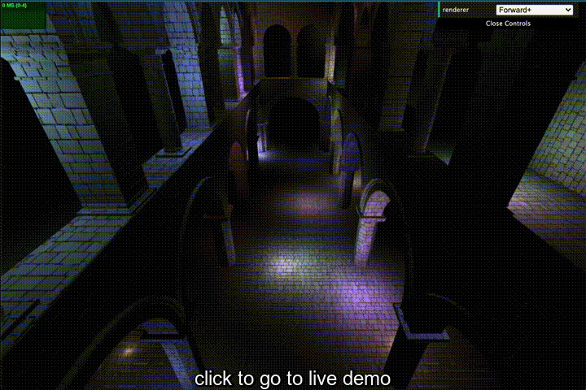
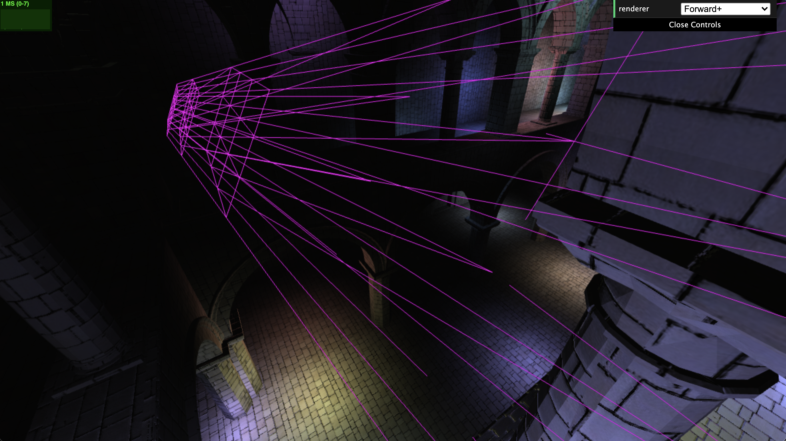
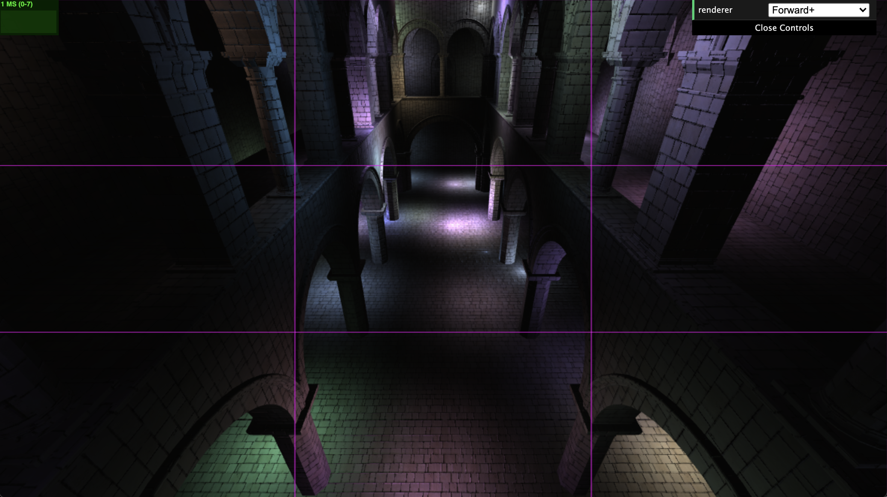

WebGL Forward+ and Clustered Deferred Shading
======================

**University of Pennsylvania, CIS 565: GPU Programming and Architecture, Project 5**

* Matt Elser
* Tested on: **Google Chrome 95.0.4638** on 2019 MacBook Pro

### What's implemented
The cluster frustums are successfully created, as can be seen when turning wireframe on:

lights are correctly associated to the intersection frustum(s), and stored in the light cluster texture.

### Hypothetical performance comparison
Based on what was shown in class, Forward+ should be significantly faster than forward shading for non-trivial numbers of lights. Forward+ can be made slower by larger light radii (a larger radius means lights will intersect more frustums, counteracting the optimization), but it should still generally be notably faster than forward. 
Clustered shading would further optimize forward+, particularly for scenes with significant distances between objects in the foreground and background, by splitting the clusters up along the camera's z-axis. 
Both of these algorithms trade a more complicated shading calculation for more efficient scene processing. 

### Credits

* [Three.js](https://github.com/mrdoob/three.js) by [@mrdoob](https://github.com/mrdoob) and contributors
* [stats.js](https://github.com/mrdoob/stats.js) by [@mrdoob](https://github.com/mrdoob) and contributors
* [webgl-debug](https://github.com/KhronosGroup/WebGLDeveloperTools) by Khronos Group Inc.
* [glMatrix](https://github.com/toji/gl-matrix) by [@toji](https://github.com/toji) and contributors
* [minimal-gltf-loader](https://github.com/shrekshao/minimal-gltf-loader) by [@shrekshao](https://github.com/shrekshao)
